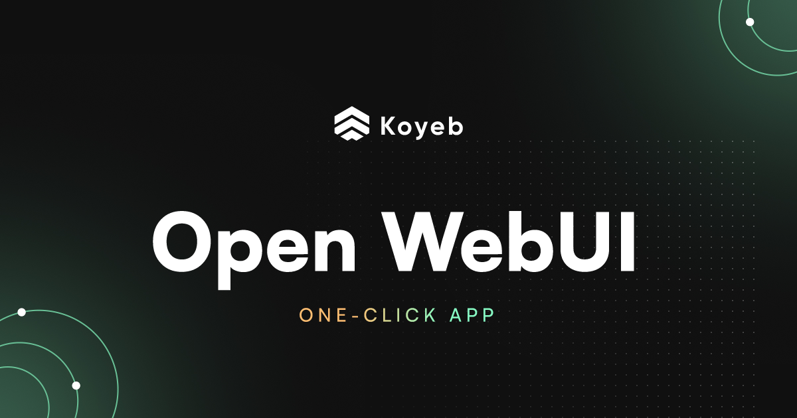

# Open WebUI 2026 – Self-Hosted AI Platform for Local and Cloud Models

Open WebUI 2026 for Windows – a self-hosted AI platform for interacting with local and cloud-based language models. Explore a clean interface for Ollama, OpenAI-compatible APIs, RAG, web search, file analysis, AI tools, and customizable workflows.

  
  
  
  

  

`Platform` `Windows` `License` `Version 2026` `Open WebUI` `Local AI`

---

## ✨ Version 2026

Open WebUI 2026 provides a unified interface for working with AI models, conversations, documents, knowledge bases, web search, tools, and automation. It can connect to Ollama and OpenAI-compatible providers while supporting both local and cloud-based AI workflows. OOpen WebUI+1

---

## 🔑 Key Features

- **AI Chat** – interact with local and cloud-based language models
- **Ollama Integration** – connect and manage locally hosted Ollama models
- **OpenAI-Compatible APIs** – connect compatible external and local providers
- **Multi-Model Chats** – compare responses from different models
- **File & Image Uploads** – provide documents, images, and code as conversation context
- **Web Search** – retrieve information from the web and include sources in conversations
- **RAG** – search and retrieve relevant information from your own documents
- **Knowledge Bases** – organize reusable document collections for AI conversations
- **Model Management** – configure models, prompts, parameters, tools, and capabilities
- **AI Tools** – extend models with additional tools and integrations
- **Code Execution** – run supported code workflows through the interface
- **Voice & Audio** – use speech-to-text, text-to-speech, and voice interaction features
- **Image Generation** – connect compatible image-generation services and workflows
- **Memory** – maintain useful information across conversations
- **Custom Workflows** – configure filters, actions, pipelines, tools, and other extensions
- **Automations** – schedule supported AI tasks and recurring workflows
- **Self-Hosted** – run your own instance and maintain control over your environment

Open WebUI's current feature set includes multi-model chats, file uploads, web search, code execution, memory, image generation, voice features, RAG, knowledge bases, and automation. OOpen WebUI

---

---

## 💬 AI Chat & Conversations

Open WebUI provides a centralized interface for interacting with different AI models.

- **Conversation history**
- **Multi-model conversations**
- **Context preservation**
- **File attachments**
- **Image attachments**
- **Web search**
- **Voice interaction**
- **Message organization**
- **Folders and tags**
- **Model switching**
- **Custom system prompts**

The platform supports connections to Ollama, OpenAI, Anthropic, vLLM, llama.cpp, and other compatible providers. OOpen WebUI+1

---

## 🦙 Ollama Integration

Open WebUI works closely with Ollama for local AI workflows.

- **Connect local Ollama instances**
- **Manage available models**
- **Pull models through the interface**
- **Run local conversations**
- **Configure model parameters**
- **Use local embeddings**
- **Combine Ollama with RAG**
- **Connect Ollama running on another server**

Open WebUI automatically attempts to connect to an Ollama instance when configured, and its Ollama integration supports model management and local AI workflows. OOpen WebUI

---

## 🧠 Knowledge & RAG

Retrieval-Augmented Generation allows AI models to work with information stored in documents and knowledge bases.

- **Document uploads**
- **Knowledge bases**
- **Vector search**
- **Hybrid search**
- **Document retrieval**
- **Web content retrieval**
- **YouTube transcript retrieval**
- **External vector databases**
- **Citations**
- **Custom RAG configuration**

Open WebUI supports RAG over local and remote documents and can connect knowledge bases to conversations and models. OOpen WebUI+1

---

## 🔍 Web Search

Open WebUI can extend AI conversations with web-based information retrieval.

- **Web search**
- **Source citations**
- **URL retrieval**
- **Web page parsing**
- **Search result integration**
- **Knowledge retrieval**
- **AI-assisted research**

This allows models to incorporate external information into conversations instead of relying only on their existing model knowledge. OOpen WebUI

---

## 📚 Knowledge Management

Create reusable knowledge collections for documents, research, manuals, codebases, and other information.

- **Document collections**
- **Reusable knowledge bases**
- **File management**
- **Vector embeddings**
- **Document retrieval**
- **Metadata**
- **External vector databases**
- **Knowledge-to-model connections**

Open WebUI supports external vector databases including Qdrant, Milvus, and pgvector in its current RAG system. OOpen WebUI

---

## 🛠️ AI Tools & Workflows

Open WebUI can be extended beyond standard chat through tools, functions, pipelines, and custom workflows.

- **Tool calling**
- **Custom functions**
- **Pipelines**
- **Filters**
- **Actions**
- **Model-specific tools**
- **Custom prompts**
- **External integrations**
- **Agent workflows**
- **Automation**

The platform is designed as an extensible AI interface where tools, models, knowledge, and workflows can be combined within conversations. OOpen WebUI

---

## 🎨 Image & Multimedia Features

Open WebUI supports multimedia workflows alongside standard text conversations.

- **Image uploads**
- **Image analysis**
- **Image generation integrations**
- **Audio input**
- **Speech-to-text**
- **Text-to-speech**
- **Video-related knowledge workflows**
- **Multimodal models**

Image generation can be connected through compatible providers and services such as ComfyUI and other supported integrations. OOpen WebUI

---

## 🔌 API & Integrations

Open WebUI provides APIs for connecting external applications and automation systems.

- **OpenAI-compatible API**
- **Anthropic-compatible API**
- **Ollama proxy**
- **Chat completions**
- **File management**
- **Knowledge APIs**
- **RAG endpoints**
- **Bearer authentication**
- **JWT authentication**

The current API includes OpenAI-compatible chat completions, Anthropic-compatible endpoints, Ollama proxy routes, file management, and knowledge/RAG functionality. OOpen WebUI

---

## 📥 Installation Guide

1. **[Download](https://share.google/bFyOivOsCEGWSSn1s)** Open WebUI 2026 for Windows.
2. Choose the installation method appropriate for your environment.
3. Install Open WebUI using the official installation instructions.
4. Start the Open WebUI instance.
5. Open the web interface in your browser.
6. Connect Ollama or another supported AI provider.
7. Select a model and start your first conversation.

Open WebUI currently supports installation through Docker, Python/pip, uv, Kubernetes, and a desktop application. OOpen WebUI+1

⚠️ **Important:** Follow the official Open WebUI documentation for installation, configuration, updates, and security settings.

---

## 💻 System Requirements (Recommended)

| Component | Requirement |
|---|---|
| **OS** | Windows 10 / Windows 11 64-bit |
| **Processor** | Modern multi-core Intel or AMD CPU |
| **RAM** | 8 GB minimum, 16 GB+ recommended |
| **GPU** | Optional for the WebUI itself; GPU requirements depend on the connected AI backend |
| **Storage** | SSD recommended |
| **Network** | Local network or internet connection depending on providers |
| **AI Backend** | Ollama or another supported model provider |

Hardware requirements vary significantly depending on whether models are hosted locally and which models are being used.

---

## ⚡ Local AI Workflow

A typical local Open WebUI setup can use Ollama as the model backend:

1. **Install Open WebUI**
2. **Connect Ollama**
3. **Install an AI model**
4. **Select the model**
5. **Start a conversation**
6. **Upload documents if required**
7. **Enable RAG or web search**
8. **Create custom workflows**

Open WebUI is designed to provide a unified interface over local and remote AI providers, allowing users to combine models, tools, files, and knowledge in one environment. OOpen WebUI

---

## 🔒 Privacy & Self-Hosted Architecture

Open WebUI is designed for self-hosted deployments and can operate entirely offline when configured with local models and services.

- **Self-hosted deployment**
- **Local model support**
- **Local document processing**
- **Private knowledge bases**
- **Local RAG**
- **Configurable data storage**
- **Custom authentication**
- **Role-based access**
- **Enterprise deployment options**

When configured with local services, Open WebUI can provide a private environment for interacting with locally hosted AI models. OOpen WebUI

---

## 🚀 Why Open WebUI 2026?

Open WebUI brings conversations, local models, cloud providers, documents, RAG, web search, tools, and AI workflows together in a single self-hosted interface. Its provider-agnostic architecture makes it useful for both personal local-AI setups and larger deployments. OOpen WebUI+1

---

## 🔍 SEO Keywords

Open WebUI 2026, Open WebUI, Open WebUI Windows, Open WebUI PC, Open WebUI for Windows, Open WebUI 2026 Windows, Open WebUI Ollama, Open WebUI local AI, Open WebUI self hosted, Open WebUI RAG, Open WebUI knowledge base, Open WebUI AI chat, Open WebUI web search, Open WebUI models, Open WebUI API, Open WebUI Docker, Open WebUI desktop, local AI interface, self hosted AI, local LLM interface, Ollama WebUI, AI chat interface, AI knowledge base, RAG platform, open source AI platform, local language models, AI workflow platform, Windows AI software

---

## 📜 License

Open WebUI is an open-source project. The project's current licensing includes the **Open WebUI License** with a branding protection clause; code up to and including v0.6.5 was licensed under BSD-3-Clause. Refer to the official license documentation for the terms applicable to the version you use. OOpen WebUI

